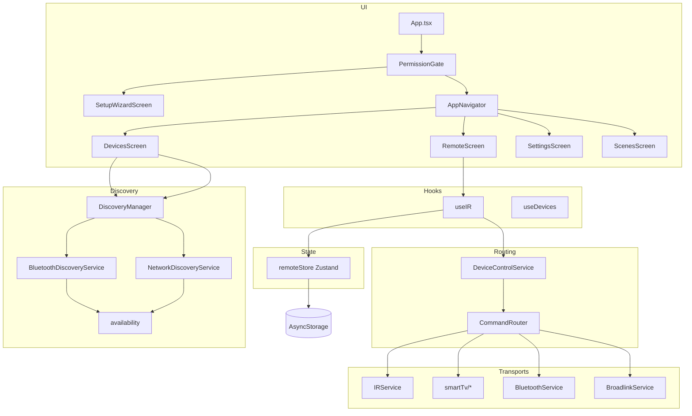

# Vue d’ensemble du projet

## But du projet

**Télécommande** (`com.telecommande`) est une application **télécommande universelle** pour smartphone. Elle vise à remplacer ou compléter les télécommandes physiques en regroupant, dans une seule interface :

- la **découverte** d’appareils sur le réseau local ou en Bluetooth ;
- l’**envoi de commandes** selon le protocole adapté (HTTP vers Smart TV, IR via le téléphone, hub Broadlink, BLE) ;
- la **personnalisation** (favoris, scènes, codes IR appris, sauvegarde JSON) ;
- le **respect du matériel** (pas d’IR sans émetteur, pas de code invalide, pas d’appareil « fantôme » dans la liste de scan).

L’app reste **dans son propre écran** pour le scan et la liste des TV : l’utilisateur n’est pas renvoyé vers les réglages système pour voir les résultats (sauf pour appairer un périphérique Bluetooth, ce qui reste une contrainte Android).

## Stack technique

| Couche | Technologie |
|--------|-------------|
| UI | React 19 + React Native 0.85 |
| Navigation | React Navigation 7 (bottom tabs) |
| État | Zustand + persistance AsyncStorage |
| Réseau local | `fetch` + timeouts, NetInfo |
| IR | `react-native-ir-manager` (ConsumerIrManager Android) |
| Bluetooth | `react-native-ble-manager` (bridge TurboModule / legacy) |
| Feedback | `react-native-haptic-feedback` |

## Architecture logique

## Cycle de vie au lancement

1. **`index.js`** enregistre le composant racine `App`.
2. **`App.tsx`** enveloppe l’app dans `GestureHandlerRootView`, `SafeAreaProvider`, `PermissionGate`, `NavigationContainer`.
3. **`PermissionGate`** appelle `ensureStartupPermissions()` (réseau, Bluetooth, contrôle IR silencieux), affiche logo + indicateur, puis affiche les enfants.
4. Si `preferences.onboardingComplete` est faux → **`SetupWizardScreen`** (matériel IR, scan réseau, première TV ou IR).
5. Sinon → **`AppNavigator`** (4 onglets).

## Routage d’une commande (résumé)

Quand l’utilisateur appuie sur une touche (ex. `vol_up`) :

1. **`useIR.sendCommand`** lit l’appareil actif dans le store.
2. Fusion éventuelle des codes **`learnedIr`** dans `device.irCodes`.
3. **`isCommandSupported`** → **`CommandRouter`** selon `protocol` / `hubId` :
   - `WiFi` → `LAN_DIRECT` → API plateforme (Roku ECP, LG, Samsung, Sony, Philips).
   - `IR` ou codes IR présents → `IR_NATIVE` → validation Pronto + émetteur → **`sendIRCode`**.
   - `hubHost` / `hubId` → `IR_GATEWAY` → Broadlink.
   - `Bluetooth` → `BLUETOOTH` → **`BluetoothService`** (souvent limité selon appareil).
4. Résultat journalisé via **`logCommand`**, retour haptique si activé.

## Découverte réseau (15 secondes)

- Durée fixe **`SCAN_DURATION_MS = 15_000`** (`scanSession.ts`).
- **Wi‑Fi** : passes répétées de sondes sur le sous-réseau /24 (Roku, Samsung, LG, Sony, Philips en parallèle par IP).
- **Bluetooth** : liste des appairés + scan BLE jusqu’à la fin du créneau, puis filtre **joignabilité** (`availability.ts`).
- **Arrêt** : `AbortController` + bouton « Arrêter le scan » ; `stopScan()` côté BLE.
- Candidats avec statut `pending` | `adopted` | `dismissed` ; seuls les joignables apparaissent après filtrage BT.

## Persistance

Clé AsyncStorage : **`universal-remote-storage-v2`**.

Contenu typique : appareils, scènes, pièces, favoris, codes IR appris, appairages LG/Samsung, candidats de découverte, préférences (haptique, confirmation power, sous-réseau par défaut).

Export/import JSON via **`ConfigExportService`** (version 1 du backup).

## Périmètre explicite (hors scope ou partiel)

- **HDMI-CEC** : route déclarée mais non implémentée sur mobile.
- **Android TV / Fire TV / Apple TV** : pas d’entrées « fictives » sans API réelle dans `tvPlatforms.ts`.
- **RF** : type `Protocol` présent, pas de pile d’envoi dédiée.
- **iOS** : projet présent ; IR/BLE selon matériel et modules natifs.

## Suite

- Types détaillés → [02-INTERFACES-ET-TYPES.md](./02-INTERFACES-ET-TYPES.md)
- UI → [03-ECRANS-ET-COMPOSANTS.md](./03-ECRANS-ET-COMPOSANTS.md)
- Services → [04-SERVICES-ET-LOGIQUE.md](./04-SERVICES-ET-LOGIQUE.md)
