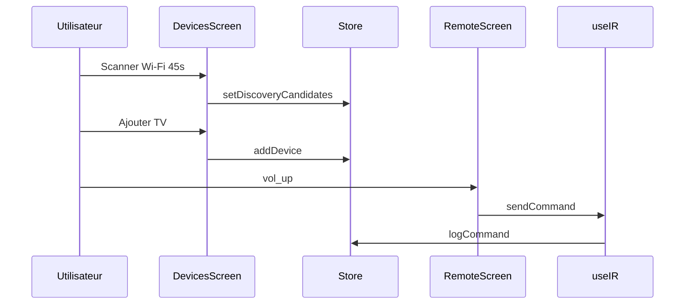

# Écrans et composants

Navigation : **4 onglets** + **assistant initial** + **modales**. Thème central : `src/theme/index.ts` (couleurs sombres, accent bleu, composants formulaire).

---

## Point d’entrée : `App.tsx`

| Comportement | Détail |
|--------------|--------|
| Enveloppes | `GestureHandlerRootView`, `SafeAreaProvider`, `PermissionGate`, `NavigationContainer` |
| Premier lancement | Si `!onboardingComplete` → `SetupWizardScreen` |
| Ensuite | `AppNavigator` |
| État local | `wizardDone` pour basculer sans recharger le store |

---

## `PermissionGate`

- Appelle **`ensureStartupPermissions()`** au montage.
- Écran de chargement : logo `app-logo.png`, `ActivityIndicator`, texte « Préparation des accès… ».
- Puis rend `children` (navigation).

---

## `SetupWizardScreen`

Assistant en **4 étapes** (`STEPS`) :

1. **Matériel** — détection émetteur IR (`getIrHardwareStatus`).
2. **Réseau** — scan **45 s** optionnel ; **Passer le scan réseau** termine l’assistant sans TV ; lien vers configuration IR manuelle.
3. **Première TV** — marque IR (`IR_BRAND_DATABASE`) ou passage direct à l’app.
4. **Terminé** — `setOnboardingComplete(true)`, callback `onDone`.

---

## `AppNavigator`

Bottom tabs (`@react-navigation/bottom-tabs`) :

| Route | Écran | Libellé |
|-------|--------|---------|
| `Remote` | `RemoteScreen` | Télécommande |
| `Scenes` | `ScenesScreen` | Scènes |
| `Devices` | `DevicesScreen` | Appareils |
| `Settings` | `SettingsScreen` | Réglages |

Barre d’onglets flottante (styles `theme`: `layout.tabBarHeight`, ombres).

---

## `RemoteScreen` — Télécommande

**Hooks :** `useIR`, `useDevices`, store (favoris, foyer).

**Sections (si appareils présents) :**

| Bloc | Composants |
|------|------------|
| En-tête | `AppHeader`, `DeviceSelector`, badge route (`routeLabel`) |
| Power / quick | `RemoteButton`, touches `QUICK_KEYS` |
| Navigation | `NavPad`, `TouchPad` |
| Chiffres | `NumPad` |
| Volume | `VolumeControls` |
| Média | `MediaControls` (filtre `isCommandSupported`) |
| Layout dynamique | `DynamicRemotePanel` (sections selon `DeviceType`) |
| Favoris | `FavoritesBar`, `FavoriteEditorModal` |
| Clavier TV | `TvKeyboardModal` si `supportsTvKeyboard` |

**Vide :** `EmptyState` + lien vers onglet Appareils.

**Envoi :** `sendCommand` / `sendText` via `useIR`.

---

## `DevicesScreen` — Appareils

| Zone | Rôle |
|------|------|
| **Détection** | `ProximitySolarScan` — orbite animée, liste lisible, scan Wi‑Fi ou BT |
| **Mes appareils** | Liste des `Device`, santé (`DeviceHealthService`), édition |
| Modales | `AddTvModal`, `PairingModal` |

**Scan :**

- `runDiscovery` / `stopDiscovery` avec `AbortController`.
- Fusion candidats : `mergeScanResults` (préserve `adopted`).
- `adopt` → `createDeviceFromPlatform` + `addDevice` + appairage si `needsPairing`.

---

## `ProximitySolarScan`

Interface props :

```ts
candidates, scanning, scanProgress, discoveryMode,
onDiscoveryModeChange, subnet, onSubnetChange,
onScan, onStopScan?, onAdopt, onDismiss
```

- Modes **Wi‑Fi** / **Bluetooth** (chips).
- Visualisation **orbite** (planètes = candidats, centre = téléphone).
- Liste sous le graphique avec badge **Ajouté**.
- Carte détail : adopter ou retirer (`dismissed`).
- Pendant scan : compteur `Xs / 45s`, bouton **Arrêter le scan**.

---

## `ScenesScreen`

- Liste des `Scene` du store.
- Exécution via `useIR.runScene` (délais entre `SceneAction`).
- Éditeur : `SceneEditorModal`, templates `sceneTemplates.ts`.

---

## `SettingsScreen`

Sections typiques :

| Section | Contenu |
|---------|---------|
| Général | Nom du foyer, préfixe réseau |
| Permissions | `PermissionsInfo` |
| Matériel IR | `HardwareIrPanel` |
| Codes IR | `IrCodeRegistration` (Pronto, validation) |
| Préférences | Haptique, confirmation power |
| Journal | `commandLog` |
| Sauvegarde | Export Share JSON, import, reset |
| À propos | Version, stack |

---

## Composants télécommande

| Fichier | Rôle |
|---------|------|
| `RemoteButton` | Touche générique, états désactivé/envoi |
| `NavPad` | Haut/bas/gauche/droite/OK |
| `NumPad` | 0–9, retour |
| `VolumeControls` | Vol±, mute |
| `MediaControls` | Play, pause, etc. (selon support) |
| `TouchPad` | Gestes → commandes directionnelles |
| `DynamicRemotePanel` | Grille depuis `getLayoutForDeviceType` |
| `FavoritesBar` | Chaînes favorites |
| `DeviceSelector` | Changement `activeDeviceId` |

---

## Modales et formulaires

| Composant | Usage |
|-----------|--------|
| `AddTvModal` | Ajout manuel plateforme / IP |
| `PairingModal` | LG / Samsung PIN |
| `TvKeyboardModal` | Saisie texte Roku |
| `FavoriteEditorModal` | Créer favori |
| `SceneEditorModal` | Éditer scène |
| `IrCodeRegistration` | Coller code Pronto par commande |
| `HardwareIrPanel` | Statut émetteur IR |
| `PermissionsInfo` | État permissions Android |

---

## Composants UI (`components/ui/`)

| Composant | Rôle |
|-----------|------|
| `Screen` | Fond + safe area |
| `ScreenScroll` | Scroll avec padding tab bar |
| `ScreenEnter` | Animation entrée |
| `AppHeader` | Titre, sous-titre, action |
| `SectionBlock` | Titre section + délai stagger |
| `Card` | Conteneur carte |
| `Badge` | Pastille statut |
| `EmptyState` | Message vide + CTA |
| `TextField` / `FormButton` | Formulaires thème |
| `FadeIn`, `AnimatedHeaderAction` | Micro-animations |

---

## `AppBackground`

Décor de fond optionnel pour certains écrans.

---

## Flux utilisateur type



Suite : [04-SERVICES-ET-LOGIQUE.md](./04-SERVICES-ET-LOGIQUE.md)
