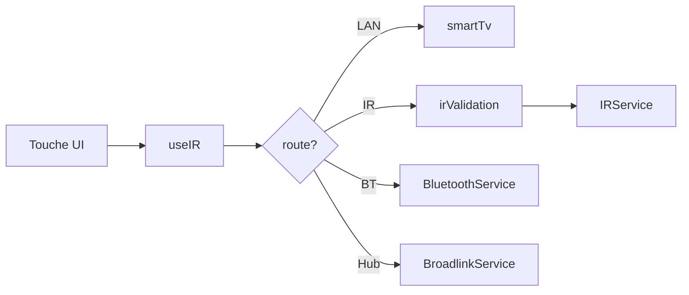

# Services et logique métier

Couche **`src/services/`** : découverte, envoi de commandes, santé, configuration. Les écrans passent par les **hooks** (`useIR`, `useDevices`) plutôt que d’appeler les services directement.

---

## Routage des commandes

### `CommandRouter.ts`

| Fonction | Rôle |
|----------|------|
| `resolveTransportRoute(device)` | Choisit `IR_NATIVE`, `LAN_DIRECT`, etc. |
| `routeLabel(route)` | Libellé français pour l’UI |
| `isCommandSupported(device, command, learnedIr?)` | Touche disponible ? |
| `routeCommand(device, command, learnedIr?)` | Envoi effectif |

**Ordre de décision :** `hubId` / `hubHost` → WiFi → Bluetooth → IR natif.

### `DeviceControlService.ts`

Façade : `isCommandSupported`, `sendDeviceCommand`, `sendDeviceText` (clavier Roku).

---

## Infrarouge

### `IRService.ts`

- Détection matériel : `hasIrEmitter`, `getIrReadiness`, `getIrHardwareStatus`.
- `sendIRCode(pronto, repeat)` — pulse via `react-native-ir-manager`.
- Conversion Pronto ↔ durées microsecondes (`parsePronto`, `durationsToPronto`).
- Test d’émission : `transmitTestBurst`.

### `ir/irValidation.ts`

| Fonction | Rôle |
|----------|------|
| `isValidProntoCode` | Format hex par groupes de 4 |
| `resolveIrCodeForCommand` | Fusion `learnedIr` + `device.irCodes` |
| `hasConfiguredIrCode` | Code valide présent ? |
| `assertIrCommandReady` | Émetteur + code — message d’erreur ou `null` |
| `deviceUsesNativeIr` | Heuristique protocole IR |

**Règle produit :** pas d’émission IR sans émetteur physique ni sans Pronto valide.

---

## Smart TV (Wi‑Fi)

### `smartTv/index.ts`

Exporte `sendSmartTvCommand`, `isWifiCommandSupported`, délègue par `TvPlatformId`.

### Fichiers par marque

| Fichier | Protocole | Découverte |
|---------|-----------|------------|
| `roku.ts` | ECP HTTP port 8060 | `probeRoku` |
| `samsung.ts` | REST / WebSocket | `probeSamsung` |
| `lg.ts` | WebSocket webOS | `probeLg` |
| `sony.ts` | IRCC HTTP | `probeSony` |
| `philips.ts` | JointSpace | utilisé en probe réseau |

### `wifiCommands.ts` / `commandMaps.ts`

- Mapping commande abstraite (`power`, `vol_up`, `netflix`, …) → requêtes par plateforme.
- `supportsTvKeyboard` — clavier texte (Roku / TCL Roku).

### `rokuApps.ts`

IDs d’applications pour raccourcis streaming Roku.

### `types.ts`

`DiscoveredTv` : `{ host, platformId, name, port? }`.

---

## Découverte réseau

### `NetworkDiscoveryService.ts`

- Génère hôtes `/24` via `subnetHosts` (`utils/network.ts`).
- Scan par **vagues** (36 IP, pause 700 ms), **14** sondes parallèles max, timeout ~420 ms.
- **`probeHost`** : Roku, Samsung, LG, Sony, Philips — une IP = une TV reconnue ou rien.
- Support **`AbortSignal`** pour arrêt utilisateur.

### `DiscoveryManager.ts`

- `scanDiscoveryCandidates(subnet, options)` — fenêtre **45 s**, max **2 passes** /24, throttle UI.
- `adoptCandidate(candidate, roomId?)` → `Partial<Device>` pour `addDevice`.

### `scanSession.ts`

- `SCAN_DURATION_MS = 45_000`, `SCAN_MAX_FULL_PASSES = 2`
- `createThrottledScanProgress`, `sleepScan`, `DiscoveryScanOptions`

**Guide utilisateur détaillé :** [07-DECOUVERTE-SCAN.md](./07-DECOUVERTE-SCAN.md) (Wi‑Fi = TV connues uniquement, BT ≠ TV seulement, crash ~25 s).

### `availability.ts`

- `filterReachableDiscoveryCandidates` — Wi‑Fi + BLE joignables.
- `isBlePeripheralReachable` — ne garde pas les appareils morts.
- Probes LG/Samsung strictes (évite faux positifs sur simple HTTP 401).

### `BluetoothDiscoveryService.ts`

1. Permissions + `BleManager.start`
2. `getBondedPeripherals`
3. Scan BLE jusqu’à fin des 45 s (`scanNearbyBle` + abort → `stopScan`)
4. Vérification par lots de 4 (`isBlePeripheralReachable`)

### `ble/bleManagerBridge.ts`

- Pas de `require('react-native-ble-manager')` au chargement du bundle.
- Résolution **TurboModule** ou **NativeModules** `BleManager`.
- API promisifiée : `scan`, `stopScan`, `getBondedPeripherals`, etc.
- `BLE_REBUILD_HINT` si module natif absent.

### `BluetoothService.ts`

- Envoi commandes BT (selon capacités du périphérique).
- `checkBluetoothDeviceOnline` pour santé / disponibilité.

---

## Hubs et appairage

### `hubs/BroadlinkService.ts`

Envoi code IR via hub Broadlink (IP `hubHost`).

### `pairing/PairingService.ts`

Flux LG / Samsung : PIN, tokens, mise à jour `PairingRecord` + `device.connection`.

---

## Santé

### `health/DeviceHealthService.ts`

- Ping / probe selon protocole.
- Met à jour `isOnline` sur les appareils (bouton « Vérifier la connexion »).

---

## Configuration

### `config/ConfigExportService.ts`

- `exportConfig` → JSON formaté v1.
- `importConfig` → parse + validation minimale.
- `RemoteBackup` consommé par `remoteStore.importBackup`.

---

## Utilitaires (`src/utils/`)

### `permissions.ts`

| Fonction | Rôle |
|----------|------|
| `ensureNetworkPermissions` | Wi‑Fi / localisation selon SDK |
| `ensureBluetoothPermissions` | `BLUETOOTH_SCAN`, `CONNECT` |
| `ensureIrPermissions` | `TRANSMIT_IR` + émetteur |
| `ensureStartupPermissions` | Lot au lancement (gate) |

### `network.ts`

- `fetchWithTimeout`, `guessLocalSubnet`, `resolveLocalSubnetPrefix`, `resolveSubnetPrefixes`, `subnetHosts`.

### `bluetoothSettings.ts`

Ouverture réglages Bluetooth système **sans** charger le module BLE (évite crash si module absent).

---

## Hooks

### `useIR.ts`

- `sendCommand`, `sendCommandToDevice`, `sendText`, `runScene`.
- Fusion `learnedIr`, tokens appairage, `assertIrCommandReady`, haptique, confirmation power, alertes.

### `useDevices.ts`

- Liste appareils, actif, helpers autour du store.

---

## Données statiques (`src/data/`)

| Fichier | Contenu |
|---------|---------|
| `devices.ts` | Types `Device`, `Scene` |
| `tvPlatforms.ts` | Catalogue plateformes + factory |
| `remoteLayouts.ts` | Sections télécommande par type |
| `irDatabase.ts` | Marques / jeux de codes IR |
| `sceneTemplates.ts` | Modèles de scènes |

---

## Diagramme envoi commande

Référence fichiers : [05-REFERENCE-FICHIERS.md](./05-REFERENCE-FICHIERS.md)
