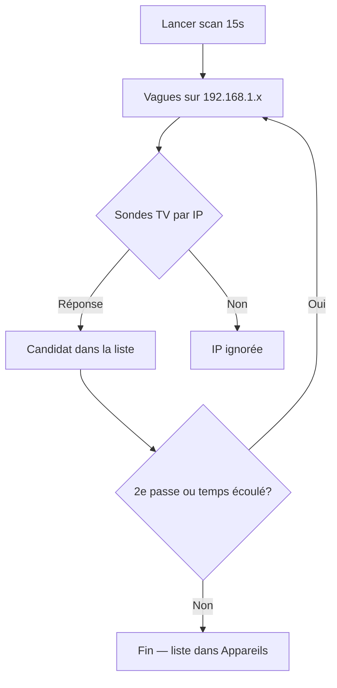

# Découverte et scan d’appareils

Comment l’app détecte les appareils, ce qui apparaît dans la liste, et comment le scan de **15 secondes** est conçu pour rester stable sur mobile.

---

## Où lancer un scan

| Écran | Mode |
|-------|------|
| **Appareils** → section Détection | Wi‑Fi ou Bluetooth (chips), bouton scan, **Arrêter le scan** |
| **Assistant première config** (étape Réseau) | Wi‑Fi uniquement, **Passer le scan réseau** possible |

Durée : **`SCAN_DURATION_MS = 15_000`** (`scanSession.ts`). Arrêt manuel via `AbortController`.

---

## Scan Wi‑Fi : est-ce que seules les TV s’affichent ?

**Oui, pour le Wi‑Fi** — mais au sens « IP qui répond comme une Smart TV connue », pas « tout appareil du réseau ».

### Étapes

1. L’utilisateur saisit un **préfixe** (ex. `192.168.1`).
2. L’app parcourt les adresses **`.1` à `.254`** par **vagues** (36 IP, pause 700 ms) pour limiter la charge réseau.
3. Pour **chaque IP**, cinq sondes HTTP courtes en parallèle (~420 ms max) :
   - Roku (8060)
   - Samsung Tizen
   - LG webOS (3000)
   - Sony Bravia
   - Philips Android TV (1925)
4. La **première** réponse valide définit la marque (`platformId`, nom, port).
5. Si **aucune** sonde ne correspond → cette IP **n’apparaît pas** (pas de téléphone, box, PC, imprimante).

```text
IP 192.168.1.42 → sondes TV → OK Roku → candidat « Roku … »
IP 192.168.1.43 → sondes TV → rien   → ignoré
```

### Marques non détectées automatiquement

Pas de scan générique Android TV / Fire TV / Apple TV sans API implémentée (`tvPlatforms.ts` — pas d’entrées « fictives »).

**Contournement :** ajout manuel (modale Appareils) ou TV **infrarouge** (IR + codes Pronto).

### Fenêtre 15 s

- Jusqu’à **2 balayages complets** du sous-réseau (`SCAN_MAX_FULL_PASSES`), avec **2,5 s** entre les passes.
- **Parallélisme** : 14 IP en même temps (pas 56 — évite crash / OOM vers ~25 s).
- Progression UI **limitée** à une mise à jour toutes les **450 ms**.

Fichiers : `NetworkDiscoveryService.ts`, `DiscoveryManager.ts`, `availability.ts`.

### Calibrage après détection

À la fin de chaque scan (Wi‑Fi ou Bluetooth), phase **calibrage** :

1. **Re-sonde** avec le protocole déjà identifié (`refineDiscoveredTv`) — nom et port réels.
2. **Vérification joignabilité** (`isWifiCandidateReachable` / connexion GATT).
3. **À l’ajout** (« Ajouter à ma télécommande ») : second calibrage avant création du `Device`.

Sondes Wi‑Fi **ordonnées** par IP (Roku → Samsung → LG → Sony → Philips) pour limiter les erreurs de type. Samsung : corps de réponse doit mentionner Tizen/Samsung (pas un simple HTTP 401 générique).

Fichier : `deviceCalibration.ts`.

---

## Scan Bluetooth : uniquement des TV ?

**Non.** Le Bluetooth liste :

- les appareils **déjà appairés** au téléphone ;
- ceux **détectés** pendant le scan BLE.

Tous sont présentés avec `platformId: bluetooth_generic` (TV, barre son, casque, etc.). Le filtre garde seulement les périphériques **joignables** :

| Origine | Critère |
|---------|---------|
| Scan BLE | RSSI ≥ -88 (pas un fantôme lointain) |
| Appairé | test de connexion GATT |

L’interface peut parler de « TV », mais techniquement ce sont des **appareils Bluetooth utilisables**.

Fichier : `BluetoothDiscoveryService.ts`.

---

## Affichage dans l’app

| Donnée | Règle |
|--------|--------|
| `discoveryCandidates` | Liste persistée (store) |
| Visible à l’écran | `status !== 'dismissed'` |
| Statuts | `pending` · `adopted` · `dismissed` |

Composant : `ProximitySolarScan.tsx` (orbite + liste). Pendant le scan, **l’animation d’orbite est arrêtée** pour réduire la charge UI.

---

## Stabilité (crash vers 25 s)

Causes corrigées :

1. **Trop de requêtes simultanées** (56 × 5 sondes par IP) → vagues + **14** connexions max.
2. **Passes /24 en boucle sans limite** → max **2 passes**, pause entre elles.
3. **Trop de `setState`** sur la progression → throttle **450 ms** + garde `mounted` sur les écrans.

Si l’app se ferme encore : arrêter le scan, vérifier le préfixe réseau, relancer ; signaler les logs Android (`adb logcat`).

---

## Schéma Wi‑Fi



---

## Liens

- [04-SERVICES-ET-LOGIQUE.md](./04-SERVICES-ET-LOGIQUE.md) — détail des services
- [03-ECRANS-ET-COMPOSANTS.md](./03-ECRANS-ET-COMPOSANTS.md) — UI scan
- [02-INTERFACES-ET-TYPES.md](./02-INTERFACES-ET-TYPES.md) — `DiscoveryCandidate`
